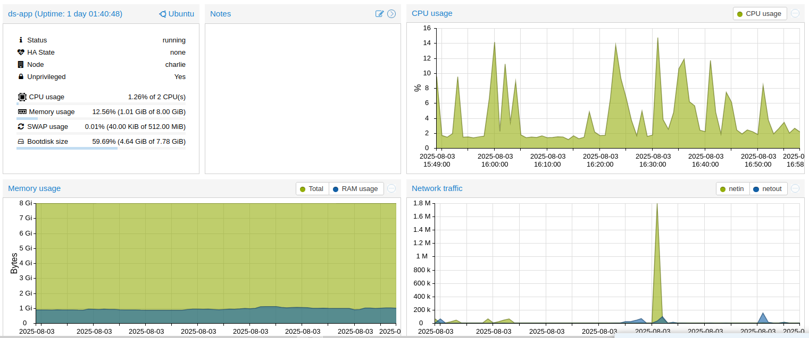
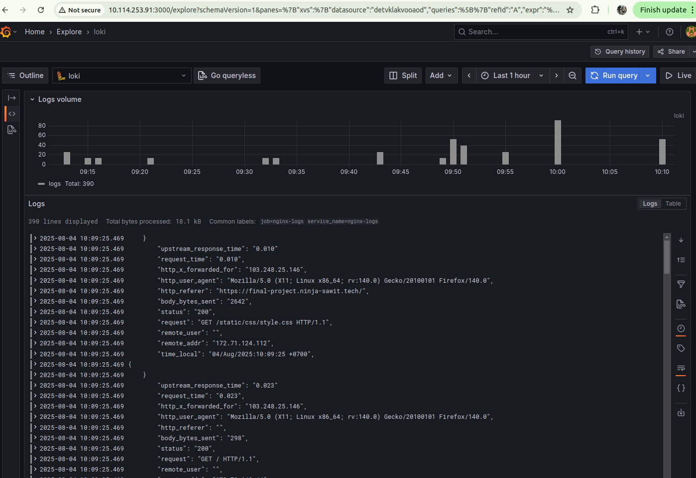
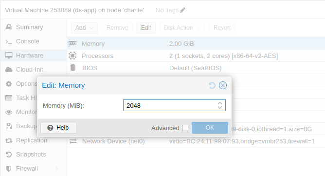

# Final Project Cloud Engineer - DigitalSkola

## Project Overview
🛠 **Cloud Application Deployment with Manual Infrastructure Setup**  

This project demonstrates a complete **cloud engineering** implementation featuring:
- **CI/CD automation** using Jenkins
- **Manual cloud infrastructure** configuration
- **Application deployment** best practices
- **Comprehensive monitoring** (metrics + logs)
- **Scaling** capabilities

---

## Project Deliverables

### 1. Git Repository
🔗 [final-project-digitalskola](https://github.com/gndhmwn/final-project-digitalskola)  
*Contains:*
- Application source code
- Jenkins pipeline configuration
- Monitoring setup scripts
- Documentation

### 2. CI/CD Pipeline
🛠️ [Jenkinsfile](https://github.com/gndhmwn/final-project-digitalskola/blob/main/Jenkinsfile)  
*Manual pipeline configuration featuring:*
- Build automation
- Deployment scripts
- Quality checks

### 3. Deployed Application
🌐 [Production Environment](https://final-project.ninja-sawit.tech/?name=Ganda+Himawan&security_code=nikah2025)  
<div align="center">
  
  <p><em>Figure 1: Production Application</em></p>
</div>

### 4. Monitoring System
#### A. Performance Metrics
📊 **Grafana Dashboard**  
<div align="center">
  
  <p><em>Figure 2: System Metrics Dashboard</em></p>
</div>

#### B. Log Management
📝 **Loki Log Monitoring**  
<div align="center">
  
  <p><em>Figure 3: Application Logs Explorer</em></p>
</div>

### 5. Scaling Demonstration
⚖️ **Manual Scaling Implementation**  
<div align="center">
  
  <p><em>Figure 4: Scaling Configuration</em></p>
</div>

---

## Technical Implementation
```mermaid
graph LR
    A[Jenkins] --> B[Manual Cloud Setup]
    B --> C[Application]
    C --> D[Prometheus]
    C --> E[Loki]
    D --> F[Grafana]
    E --> F